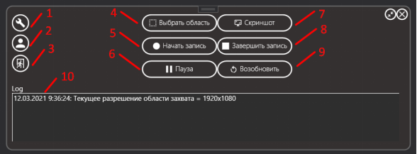

# Screen Recorder application with Google Drive API

## `UI`

The base UI looks like then (WPF app):

1) opens the settings window;
2) opens the login window;
3) closes the application's access to Google drive;
4) starts the capture area selection function;
5) starts screen capture recording;
6) pauses the screen capture recording;
7) creates a screenshot of the screen;
8) ends screen capture recording;
9) resumes the paused screen capture recording;
10) log display panel.

## `Used dll's`

- CSScreenRecorder library
- Google Drive API
- WPF user interface add-ons model

Creared in 2021 year.
